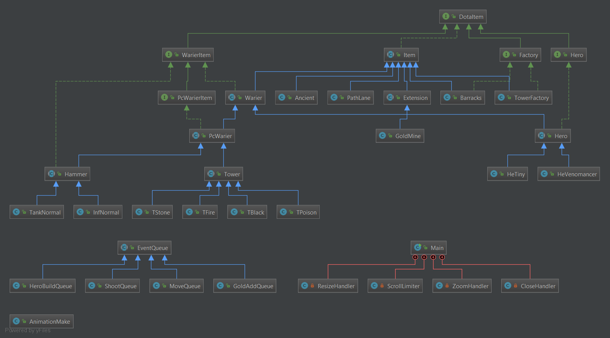
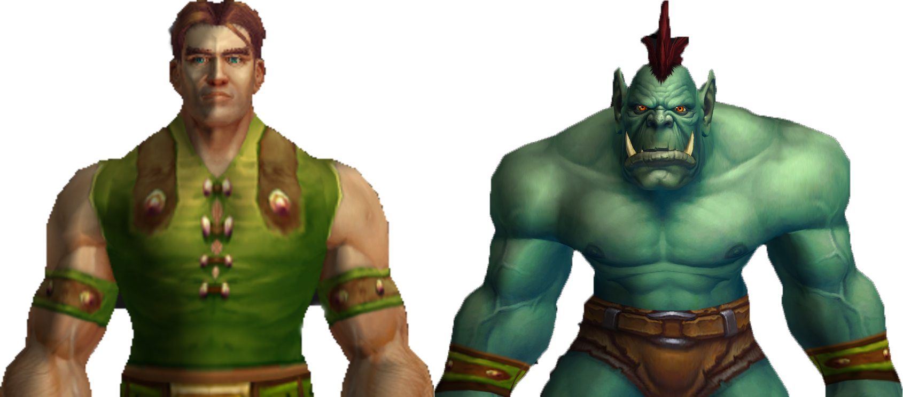
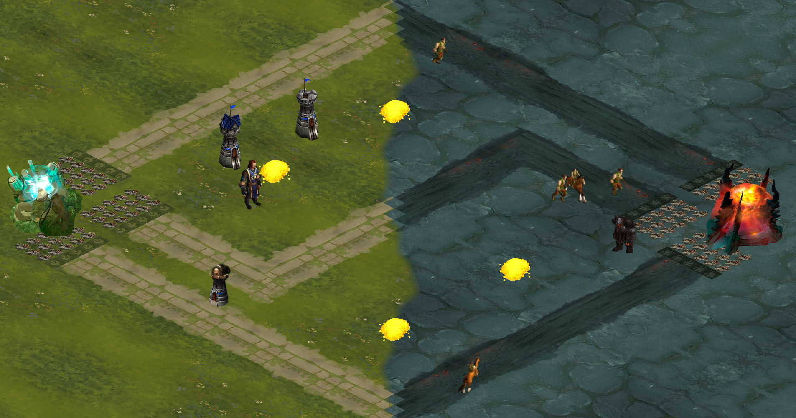
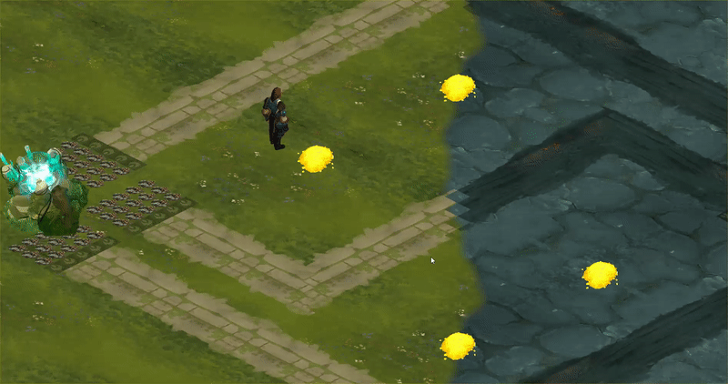

# Mini DOTA2 game in Java
This is a mini [DOTA2](http://blog.dota2.com/?l=english) game in Java that is graphic with JavaFX.
## Prerequisites
[ControlFX](https://github.com/controlsfx/controlsfx), it is really simple to install. Just download the Jar file and then add it to your project library. for example, if you use IntelliJ idea you can do it [this way](https://stackoverflow.com/questions/1051640/correct-way-to-add-external-jars-lib-jar-to-an-intellij-idea-project)
## code UML and class:

## How to run?
Run **GameStarter.java** file two times (one for the server and one for the client). starting the game is fully pictured in Gif one.
## How to play?
If you are familiar with [DOTA2](http://blog.dota2.com/?l=english), it would be easy for you to understand the game.
There are two groups, humans and orc.

now you can create towers and soldiers to fight and move your hero and hit the enemy. the goal is to destroy the enemies main building.
the picture of the middle game is like this:

## Gifs:
#### one: start

#### two: you cand mode your hero with "W", "A", "S", "D" keys.

## Author

* **Peyman Mohseni kiasari**

## License

This project is licensed under the MIT License - see the [LICENSE.md](LICENSE.md) file for details